# Issuer | Identity

Backoffice del emisor del sistema de ejemplo LNetIdentity — el rol **Credential Issuer** (2). Emite
credenciales verificables al DID de un holder, lista lo que emitió y lo verifica. El detalle del
modelo de roles y de la cadena de confianza está en el [README raíz](../Readme.md).

Funciona hoy: login/logout, wizard de emisión de 4 pasos con formulario generado desde el esquema,
listado y detalle de credenciales, y verificación. La revocación está en la UI pero deshabilitada
(ver [Problemas conocidos](#problemas-conocidos)). Es una PWA instalable: no tiene backend propio,
es un SPA que habla directo con la API (CORS abierto del lado del servicio).

## Funcionalidades

| Flujo | Pantalla | Endpoint con `dwallet` | Endpoint con `ssi-vc` |
| --- | --- | --- | --- |
| Login / logout | `/login` | `POST /login` (+ `POST /wallet-id` como fallback), `POST /logout` | siempre va contra `dwallet` |
| Emisión (wizard de 4 pasos) | `/issue` | `POST /vc` | `POST /vc` (payload legacy) |
| Listado de credenciales emitidas | `/credentials` | `GET /issuer/{did}` | `GET /vc` |
| Detalle de una credencial | `/credentials/:id` | `GET /issuer/{did}/id/{id}` | `GET /vc/{id}` |
| Verificación | `/credentials/:id` | `POST /verify` | `POST /verify` (ver nota) |
| Revocación | `/credentials/:id` | `DELETE /vc/:id` — no desplegado | — |
| Escaneo del QR con el DID del holder | paso 3 del wizard | — (lectura local) | — |
| Perfil e identidad emisora | `/profile` | — | — |

## Puesta en marcha

```bash
npm install
```

```bash
npm run dev
```

La app queda en `http://localhost:5173`.

```bash
npm run build    # tsc -b + vite build: la forma más rápida de tipar todo el proyecto
npm run lint     # oxlint
npm run preview  # sirve el build de producción
```

Los comandos se corren desde este directorio: cada ejemplo del repo tiene su propio `package.json`
y no hay workspace que los ate.

## Configuración

**No hay secretos en variables de entorno.** El emisor entra con su usuario de Keycloak desde la
propia pantalla de login, y el resto de la configuración sensible se carga a mano desde la app y
queda en el navegador.

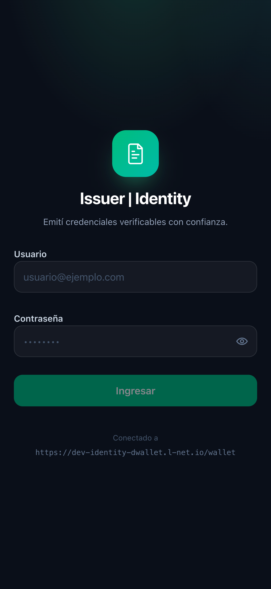

`VITE_IDENTITY_API_BASE_URL` y `VITE_SSI_VC_API_BASE_URL` (ver `.env.example`) **solo definen las
URLs que aparecen por defecto en Configuración**; una vez que el usuario guarda las suyas, mandan
las guardadas. El resto de los valores por defecto (API key de ssi-vc, claims verifier) vive en
`src/config/wallet.ts`, en un solo lugar, para no dispersar endpoints y contratos por los
componentes.

### Configuración dentro de la app

El engranaje del header abre la configuración del emisor. Lo primero que se elige ahí es **contra
qué backend trabajar**, y eso cambia qué campos hacen falta:

| `dwallet` | `ssi-vc` |
| --- | --- |
| 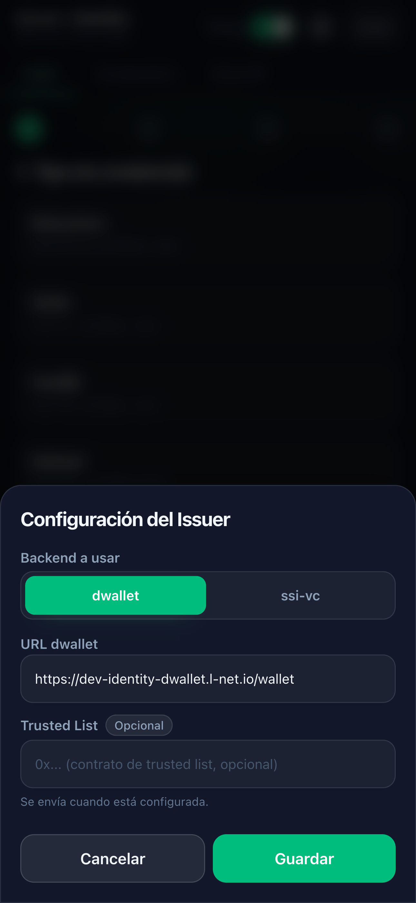 | 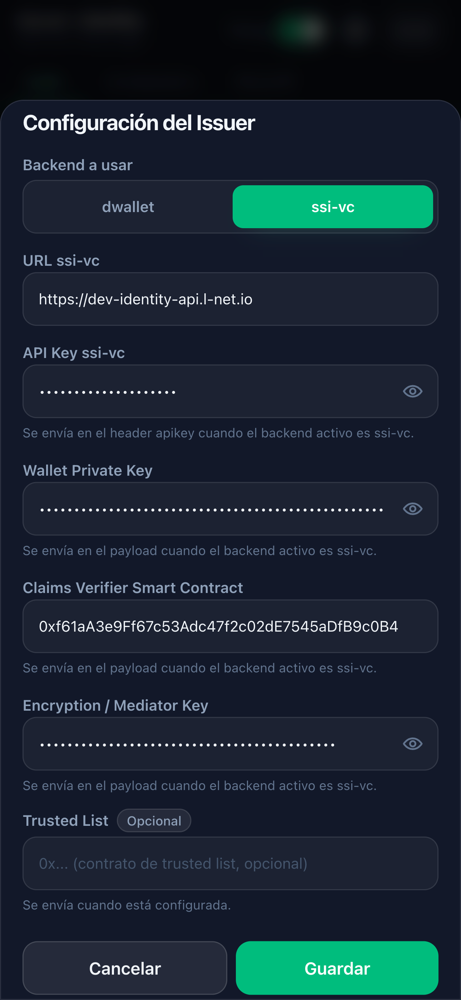 |
| Solo requiere la URL. Autentica con el Bearer del login. | Requiere URL, API Key, Wallet Private Key, Claims Verifier y Mediator Key. Autentica **solo** con la API Key en el header `apikey`. |

`Trusted List` es opcional en ambos y es el contrato que enlaza la emisión con la lista de confianza
del rol 1.

Todo se guarda en `localStorage`, **por usuario**, en `vc-issuer:settings:{username}` — dos emisores
que usen el mismo navegador no se pisan la configuración. La sesión vive en `vc-issuer:auth` y el
interruptor de Debug en `vc-issuer:debug`.

Antes de emitir, `getMissingSettings` (`src/utils/settings.ts`) corta el intento y nombra los campos
que faltan, en vez de mandar un payload incompleto y hacer que el backend responda un error opaco.

> El login siempre se hace contra `dwallet`: el `SettingsProvider` recién se monta dentro de la
> sesión, así que el selector de backend afecta la emisión y la lectura de credenciales, no el
> login. Por eso la pantalla de login muestra abajo la URL a la que se está conectando.

## Emisión de una credencial

El wizard tiene cuatro pasos y un resultado:

| 1. Tipo de credencial | 2. Datos (formulario vacío) |
| --- | --- |
| 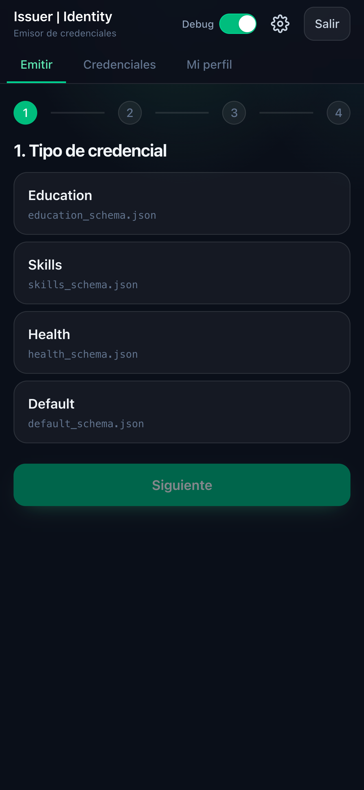 | 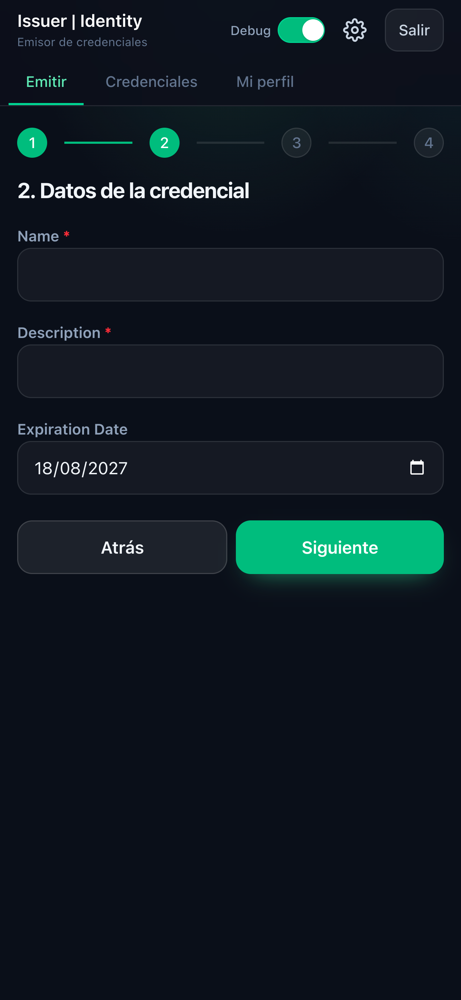 |
| **2. Datos (completado)** | **3. Destinatario** |
| 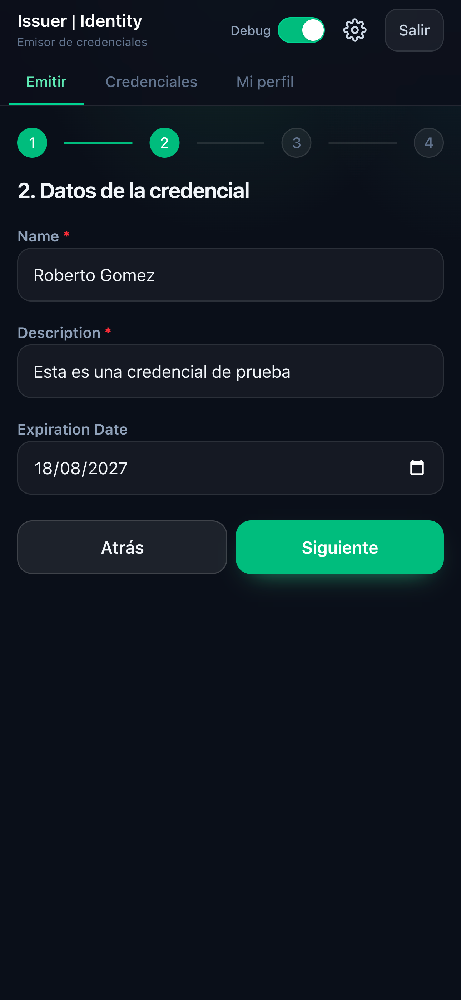 | 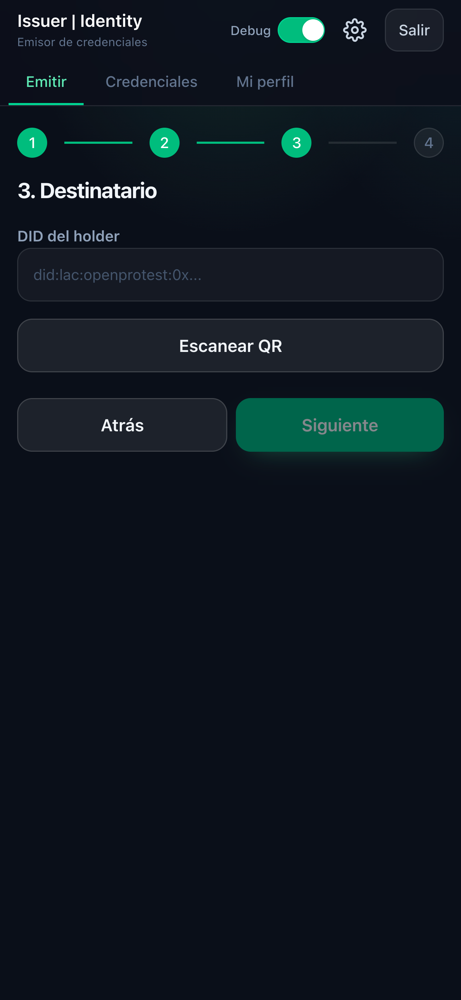 |
| **4. Revisión** | **Resultado** |
| 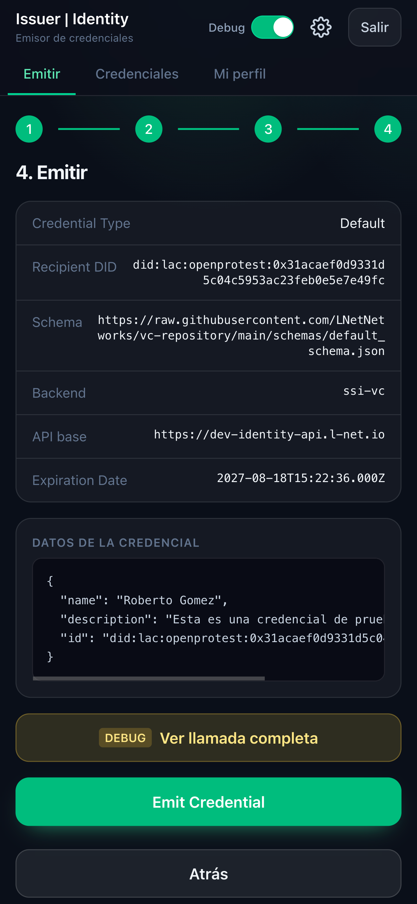 | 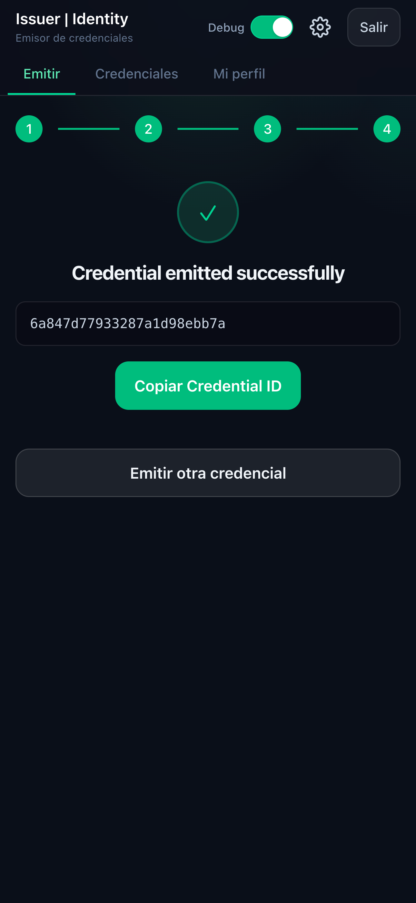 |

1. **Tipo.** Los cuatro tipos y la URL de su esquema están en `src/data/credentialTypes.ts`.
2. **Datos.** `DynamicForm` arma el formulario leyendo `properties.credentialSubject` del esquema:
   los tipos, los `enum` y los `format: date` salen de ahí, no de un formulario escrito a mano.
   `fetchSchema` intenta primero la URL real del esquema y cae al esquema local bundleado si esa URL
   no responde. La expiración por defecto es un año.
3. **Destinatario.** El DID del holder se pega o se escanea con la cámara (`qr-scanner`). El escaneo
   necesita HTTPS o `localhost`; si la cámara falla, el campo de texto sigue estando.
4. **Revisión.** Muestra exactamente lo que se va a mandar, incluido el backend y la URL activa.

El `id` del `credentialSubject` no se pide en el formulario: se completa con el DID del destinatario
(`skipField="id"` en el paso 2, y `data: { ...formValues, id: recipientDid }` al armar el request).

### Lo que se manda

Con `dwallet`, autenticado con el Bearer del login:

```jsonc
POST {dwalletApiBaseUrl}/vc
{
  "did": "<DID del emisor>",
  "subject": "<DID del holder>",
  "type": "Education",
  "context": "https://raw.githubusercontent.com/LNetNetworks/vc-repository/main/schemas/education_schema.json",
  "validUntil": "2027-08-18T15:22:36.000Z",
  "data": { "...": "credentialSubject", "id": "<DID del holder>" },
  "trustedList": ""
}
```

Con `ssi-vc`, autenticado solo con `apikey`, cambia la forma del payload (es el contrato viejo del
servicio): `claimsVerifier`, `privatekey` y `mediatorKey` en el cuerpo, sin `did` del emisor.

`context` no es un campo decorativo: `dwallet` lo dereferencia como JSON-LD del lado del servidor.
Apuntarlo a una URL que no resuelve hace fallar la emisión con `ERR_SCHEMA_INVALID` — hoy ese es el
caso de 3 de los 4 esquemas (ver [Problemas conocidos](#problemas-conocidos)).

### Modo Debug

El interruptor **Debug** del header habilita, en el paso 4, el botón *Ver llamada completa*: un modal
con el endpoint, los headers y el payload exactos, listos para copiar como `fetch`. Es la forma de
comparar contra Swagger o contra otro cliente sin instrumentar el código. Los headers salen
enmascarados (`<api-key>`, `<access-token>`), pero **el payload se muestra completo** — con `ssi-vc`
activo eso incluye la private key en claro.

## Credenciales emitidas y verificación

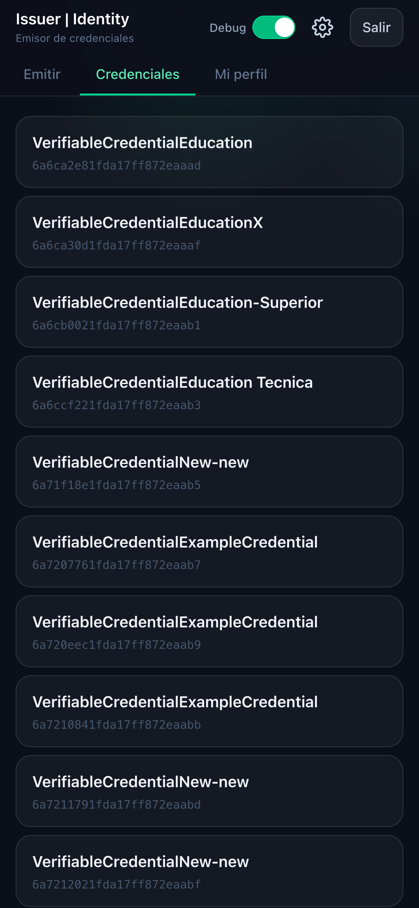

El listado se pide con el DID del emisor y cada ítem lleva al detalle, que muestra la VC completa tal
como la devuelve el servicio. Desde ahí, *Verify* llama a `POST /verify` con `{ vc: { credential } }`
y muestra las dos respuestas que devuelve el servicio: `validacionVc` (la credencial es válida) y,
cuando viene, `trustChain` (el emisor está en la lista de confianza) — que es justamente la decisión
que le importa al rol 4.

*Revoke* está a la vista pero deshabilitado: el endpoint no existe en este ambiente.

## Mi perfil

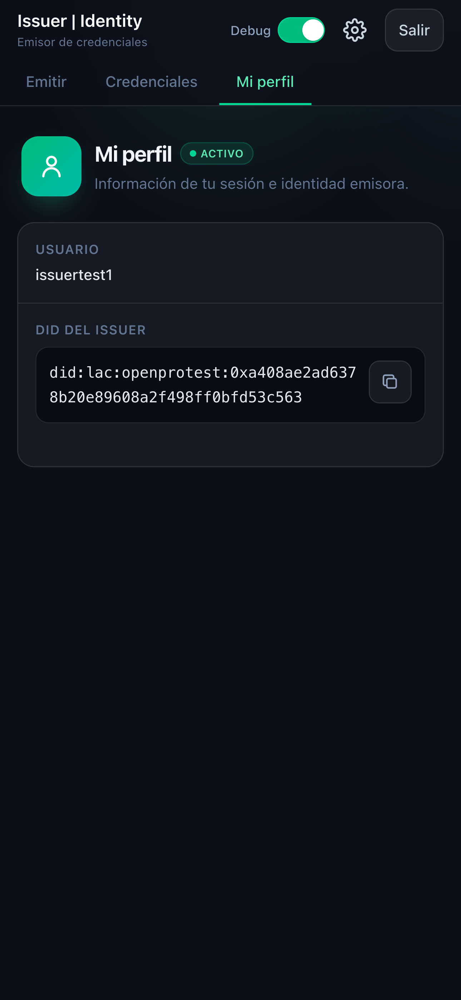

Muestra el usuario de la sesión y el DID del emisor, con copia al portapapeles (con fallback a
`execCommand` para contextos no seguros, donde `navigator.clipboard` no existe). Ese DID es el que se
usa como `issuer` en cada emisión y como clave del listado.

## Notas de implementación

- **Sesión.** El token se guarda en `localStorage` y se reinyecta al cliente HTTP al arrancar. No hay
  endpoint de refresh. La API envuelve Keycloak y reporta el token vencido como un error cuyo
  `message` empieza con `ERR_KEYCLOAK_AUTHENTICATE`, no como un 401 limpio: el cliente detecta ese
  prefijo, limpia la sesión y vuelve al login con "Tu sesión expiró", en lugar de mostrar un error
  crudo sobre un JWT.
- **DID del emisor.** `POST /login` ya devuelve el DID junto al token y ese es el que se usa;
  `POST /wallet-id` quedó como fallback para ambientes que no lo incluyan. No conviene invertir la
  prioridad: en el deployment de dev, `/wallet-id` puede devolver un DID de wallet distinto.
- **Errores.** `APIError` conserva método, endpoint, status, `code` y cuerpo de la respuesta, y la UI
  los muestra tal cual en un bloque monoespaciado. Es deliberado: contra un backend en desarrollo, el
  mensaje real del servicio (`ERR_CREDENTIAL_REGISTER: ... Caller is not a issuer`) es mucho más útil
  que un "algo salió mal".
- **Un solo cliente, dos backends.** `src/api/client.ts` mantiene el backend activo y la URL de cada
  uno; `src/api/vc.ts` decide por backend la ruta, la forma del payload y el modo de autenticación.
  Al `ssi-vc` no se le manda nunca el Bearer.
- **Trusted List.** Con `dwallet` el payload **siempre** incluye `trustedList` (string vacío si no
  está configurado), aunque el campo esté rotulado "Opcional" y el texto de ayuda diga que se envía
  solo cuando está cargado.
- **Validación del formulario.** Los campos requeridos del esquema se marcan con asterisco, pero no
  bloquean el paso 2: el wizard deja avanzar con el formulario incompleto y el rechazo llega del
  backend.
- **Fechas.** `toISODateTime` combina la fecha elegida con la hora capturada al cargar el módulo y
  produce un instante ISO 8601 en UTC, que es lo que espera `validUntil`.
- **PWA.** `vite-plugin-pwa` con `registerType: 'autoUpdate'`, manifest en modo `standalone`, iconos
  normales y maskable, y metatags de iOS en `index.html` porque Safari no lee el manifest para
  "Agregar a pantalla de inicio". El service worker precachea el app shell; **las respuestas de la
  API no se cachean** (regla `NetworkOnly` para el host de dwallet): son datos con token.

## Estructura

```
src/
├── api/          cliente HTTP (backend activo, token, errores), auth y operaciones de VC
├── components/   layout, formulario dinámico, escáner QR, modales de settings y debug
├── config/       valores por defecto de dwallet y ssi-vc, en un solo lugar
├── context/      sesión, configuración por usuario y modo debug
├── data/         tipos de credencial y sus esquemas (con fallback local)
├── pages/        una pantalla por archivo; el wizard de emisión en su propia carpeta
└── utils/        fechas y validación de la configuración
schemas/          los 4 esquemas del ticket, listos para subir a vc-repository
screenshots/      capturas usadas en este README
```

## Problemas conocidos

Encontrados al integrar contra el deployment real, no leyendo solo el Swagger. Van acá porque el
README raíz pide anotar cada problema en el README de la app relacionada.

- **`POST /vc` solo funciona si el emisor tiene `ISSUER_ROLE`.** Es hoy el único control sobre la
  emisión. Sin ese rol el backend responde `ERR_CREDENTIAL_REGISTER: ... Caller is not a issuer` y la
  app lo muestra tal cual — confirmado en vivo con `issuertest1`. No es algo que el frontend pueda
  resolver.
- **En `vc-repository` solo existe `test_reference.json`.** Los 4 esquemas del ticket
  (`education_schema.json`, `skills_schema.json`, `health_schema.json`, `default_schema.json`) dan
  404 en `raw.githubusercontent.com`. Están bundleados localmente en `src/data/credentialTypes.ts`
  para que el paso 2 siga funcionando, y `fetchSchema` los tomará de la URL real apenas se publiquen.
  Los archivos exactos están en `schemas/` (van a `vc-repository`, no a este repo). Como `dwallet`
  dereferencia `context`, la emisión contra ese backend falla mientras la URL no resuelva; la corrida
  de las capturas, con `ssi-vc` y `default_schema.json`, sí completó.
- **No hay revocación ni buzón desplegados.** `DELETE /vc/:id` y `POST /vc/messages` dan 404 aunque
  el README raíz describa la revocación dentro del alcance de esta app. El botón *Revoke* está
  presente pero deshabilitado, y `revokeVC`/`getMailbox` (`src/api/vc.ts`) lanzan un error explícito:
  están escritos contra la forma documentada y solo esperan que el endpoint exista.
- **`POST /verify` no distingue backend.** Usa la base activa y manda siempre el Bearer, nunca el
  header `apikey`. Con `ssi-vc` seleccionado, la verificación sale hacia la base de `ssi-vc` sin API
  key.
- **El modal de Debug muestra el payload completo.** Los headers salen enmascarados, pero con
  `ssi-vc` el cuerpo incluye `privatekey` y `mediatorKey` en claro. Es una herramienta de desarrollo:
  conviene no usarla con una pantalla compartida.
- **El Swagger no coincide con el deployment.** El base path real es `/wallet`, la forma real de
  `POST /vc` difiere de la documentada y `/login` devuelve el DID además del token. El código sigue
  lo verificado en vivo, no el Swagger.
- **Todavía no se comparó contra el front de referencia** (`https://dev-identity-app.l-net.io/`) que
  menciona el README raíz, incluido si el backend puede alimentar el desplegable de tipos y esquemas
  en lugar de la lista fija de `credentialTypes.ts`.

## Estado de la verificación

Los flujos de las capturas se probaron contra el ambiente de dev con el usuario `issuertest1`:
login, wizard completo, emisión con `ssi-vc`, listado y detalle. No hay framework de tests
configurado en el repo; `npm run build` (que corre `tsc -b` antes) es la verificación más rápida de
que un cambio no rompió nada.
