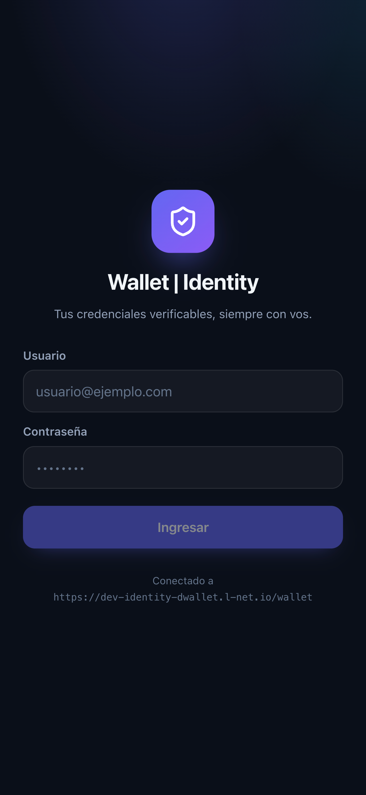
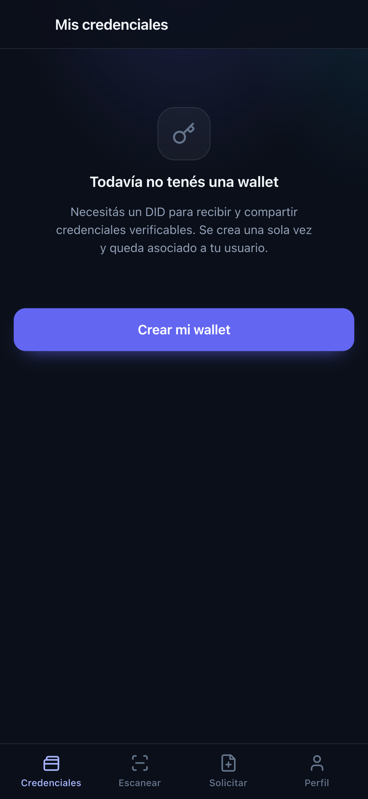
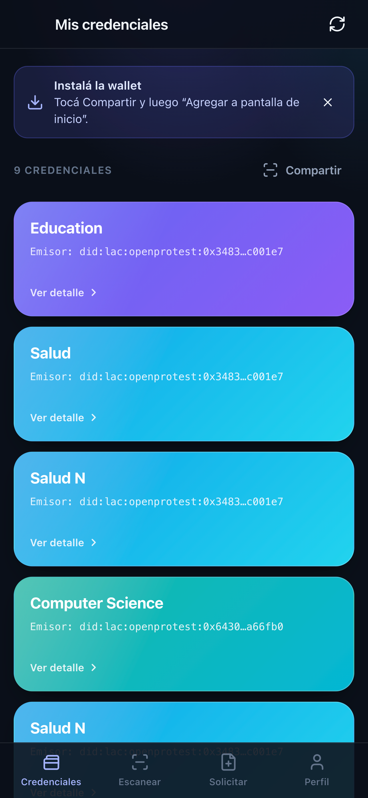
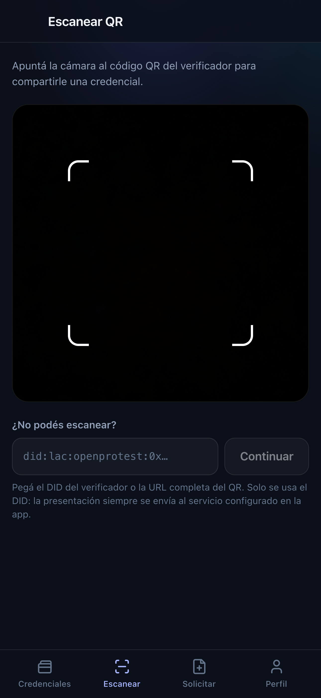
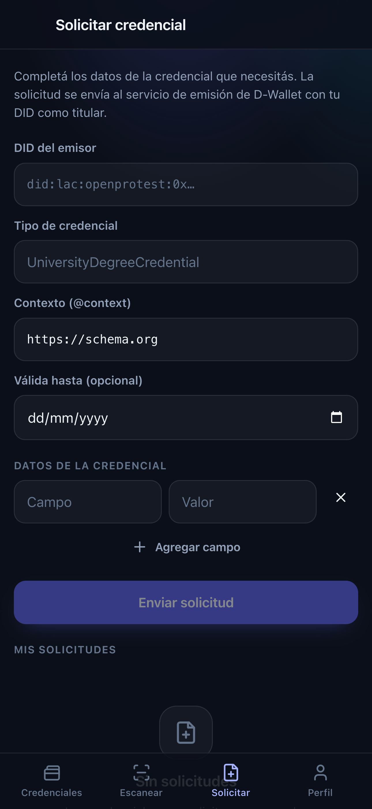
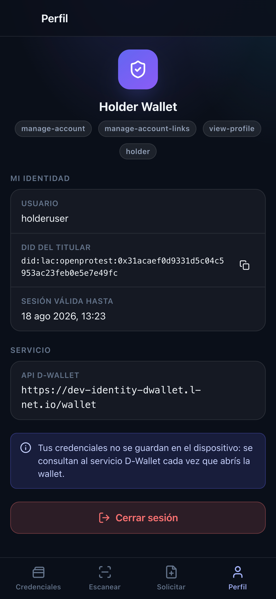

# wallet-webapp

Wallet del holder para el sistema de ejemplo LNetIdentity — el rol **User (3)**. Es una PWA
que corre en el navegador y se instala en la pantalla de inicio de Android e iOS: el usuario
inicia sesión, crea su DID, consulta las credenciales verificables que le emitieron y las
comparte con un verificador escaneando su QR. Ver la [especificación del ejercicio](../Readme.md)
para el modelo completo de roles y la cadena de confianza.

Están implementados el login, la creación de la wallet DID, el listado y el detalle de
credenciales, el escaneo del QR del verificador y el envío de la presentación verificable (VP).
La pantalla de solicitud de credenciales existe pero depende del rol `issuer`, que un holder no
tiene (ver [Problemas conocidos](#problemas-conocidos)). El listado y el login están probados
contra el deployment real; la compartición todavía no.

## Funcionalidades

| Flujo | Pantalla | Endpoints |
| --- | --- | --- |
| Login / logout | `/login`, `/profile` | `POST /login`, `POST /logout` |
| Creación de la wallet DID | onboarding embebido | `POST /`, con respaldo `POST /wallet-id` + `POST /wallet-document` |
| Listado de credenciales | `/` | `GET /holder/{did}` |
| Detalle de credencial | `/credential/:id` | `GET /holder/{did}/id/{id}` |
| Escaneo del QR del verificador | `/scan` | — (lectura local, sin red) |
| Selección y envío de la VP | `/share?verifier=…` | `POST /shareverify/{didVerificador}` |
| Solicitud de credencial | `/request` | `POST /vc` |
| Perfil, roles y sesión | `/profile` | — (lee el JWT) |

## Puesta en marcha

Se corre desde este directorio, no desde la raíz del repo: cada ejemplo tiene su propio
`package.json`.

```bash
npm install
```

```bash
npm run dev
```

La app queda en `http://localhost:5173`. El servidor de desarrollo escucha en todas las
interfaces (`server.host: true` en [vite.config.ts](vite.config.ts)), así que también se abre
desde el teléfono con la IP de la máquina — necesario para probar la cámara y la instalación en
el dispositivo.

```bash
npm run build    # tsc -b + vite build (también es el typecheck completo más rápido)
npm run lint     # oxlint (sin archivo de configuración: corre con los defaults)
npm run preview  # sirve el build de producción con fallback de SPA
```

> No hay framework de tests configurado en este repo. `npm run build` y `npm run lint` son la
> única verificación automática disponible.

## Configuración

No hay secretos en variables de entorno. El holder se autentica desde la UI con su usuario de
Keycloak y el token queda solo en el navegador.

La única variable es la URL del backend:

```
VITE_API_BASE_URL=https://dev-identity-dwallet.l-net.io/wallet
```

Se copia [`.env.example`](.env.example) a `.env.local` para cambiarla. Si no está definida,
[`lib/api.ts`](src/lib/api.ts) usa ese mismo valor por defecto y le recorta las barras finales.
El valor **tiene que incluir el base path `/wallet`** del router: el documento OpenAPI declara
`/wallet` como server base, así que el `post_login` que muestra el Swagger UI es en realidad
`POST /wallet/login`.

No hace falta proxy ni servidor propio: la API responde `Access-Control-Allow-Origin: *` y
acepta el header `Authorization` en el preflight, así que el navegador la llama directo. La app
es un SPA cliente puro.

Lo que la app guarda en `localStorage`, todo por navegador y sin cifrar:

| Clave | Contenido |
| --- | --- |
| `piw.session.v1` | Tokens, DID, usuario, roles y vencimiento de la sesión |
| `piw.credential-requests.v1` | Historial local de solicitudes de emisión (últimas 50) |
| `piw.install-banner-dismissed` | Si el usuario descartó el aviso de instalación |

## Ingreso y creación de la wallet

El login llama a `POST /login` con `{user, password}` y guarda el `access_token`. El pie de la
pantalla muestra siempre contra qué servicio se está autenticando, que es lo primero que hay que
descartar cuando algo falla en un teléfono.

Si el usuario todavía no tiene DID (`did` ausente en la respuesta del login y en el token), toda
pantalla que necesite uno muestra el onboarding de [`WalletSetup`](src/components/WalletSetup.tsx)
en lugar de su contenido: listado, solicitud y perfil comparten el mismo componente.

| Login — `POST /login` | Sin wallet — onboarding del DID |
| --- | --- |
|  |  |

`provisionWallet` en [`lib/wallet.ts`](src/lib/wallet.ts) intenta primero `POST /` (creación
completa) y solo cae a la secuencia `POST /wallet-id` + `POST /wallet-document` si ese endpoint
falla. Un 401 o un 403 se propagan sin reintentar: son de permisos, no de disponibilidad. Y si
`POST /` responde OK pero sin `did`, la app **no reintenta** — muestra un error pidiendo volver a
iniciar sesión, porque repetir la llamada podría crear una segunda wallet para el mismo usuario.

## Mis credenciales

El listado sale de `GET /holder/{did}`. Cada tarjeta muestra el tipo humanizado
(`UniversityDegreeCredential` → `University Degree`, ver `humanizeType`) y el DID del emisor
abreviado. El color de cada tarjeta es un hash estable del tipo (`accentIndex`, 6 gradientes),
así que una misma clase de credencial conserva su color entre sesiones.



La vigencia (`Vigente`, `Vencida`, `Aún no vigente`) solo aparece en las tarjetas cuyo detalle ya
se consultó: el listado del backend no la trae, así que forzarla obligaría a un `GET` por
credencial. Con el detalle en caché la tarjeta se enriquece sola.

`/credential/:id` trae el objeto W3C completo con `GET /holder/{did}/id/{id}` y lo muestra en tres
bloques: los claims de `credentialSubject` aplanados a pares etiqueta/valor (`flattenClaims`
recorre objetos y arreglos anidados y omite el `id` de la raíz, que es el DID del titular y ya se
muestra aparte), la información técnica (estado, ids, emisor, titular, vigencia, trusted list) y
la credencial cruda en JSON dentro de un `<details>`. El botón «Compartir esta credencial» va
antes del bloque técnico a propósito: en pantallas chicas quedaba abajo de todo.

## Compartir una credencial

El QR del verificador puede traer la URL completa que publica el servicio:

```
http://dev-identity-dwallet.l-net.io/wallet/shareverify/did:lac:openprotest:0x1975b634…
```

o directamente el DID. **En ambos casos la wallet extrae solo el DID** y arma la petición contra
la API configurada en `VITE_API_BASE_URL`. Es una decisión deliberada de
[`lib/qr.ts`](src/lib/qr.ts), por dos motivos:

- un QR manipulado no puede redirigir la credencial a un host arbitrario;
- evita el bloqueo por *mixed content* cuando el QR trae una URL `http://` y la PWA corre sobre
  HTTPS, que es exactamente el caso del ejemplo de arriba.



Si la cámara no está disponible —permiso denegado, sin HTTPS, o navegador sin soporte— la
pantalla degrada al campo de abajo para pegar el DID o la URL a mano; el mismo parser atiende los
dos caminos. Al llegar desde el detalle de una credencial, esa credencial queda preseleccionada.

Con el DID del verificador y la credencial elegida, `/share` llama a
`POST /shareverify/{didVerificador}` con `{did_holder, id_vc}`. El backend verifica la VC y la
envía al verificador como Verifiable Presentation. La pantalla final muestra el resultado y, ante
un error, permite reintentar sin volver a escanear y ofrece el detalle técnico crudo para copiar.
Si hay una sola credencial en la wallet, se selecciona sola.

## Solicitar una credencial



La API de D-Wallet **no expone un endpoint de solicitud del lado del holder**: la emisión se hace
con `POST /vc` y requiere rol `issuer`. Esta pantalla arma esa misma petición con el DID del
usuario como `subject` y el DID que se tipea arriba como emisor, y trata el rechazo como parte
del flujo normal:

- con rol `issuer`, la credencial se emite y aparece en el listado (`status: issued`);
- sin ese rol la API responde 403 y la solicitud queda guardada en el historial local con estado
  **Pendiente**, para que el usuario se la pase al emisor por fuera de la app;
- cualquier otro error la guarda como **Error** con el mensaje del servicio.

El registro se guarda siempre, en el `finally`: el valor de la pantalla es justamente dejar
constancia de lo que se pidió cuando la emisión no se pudo completar.

## Perfil y sesión



Los roles que se ven como badges se leen del propio access token (realm + cliente,
deduplicados, descartando los internos de Keycloak como `default-roles-*`, `offline_access` y
`uma_authorization`). En la captura el usuario tiene `holder` y **no** `issuer`, que es la
situación normal de un holder y la razón por la que la solicitud de credenciales termina en
Pendiente.

El aviso al pie es literal: la wallet no persiste credenciales en el dispositivo, solo tokens.
Cada apertura las vuelve a pedir al servicio.

## Notas de implementación

**Sesión.** Los tokens se guardan en `localStorage` y el store se conecta al cliente API en
tiempo de import (`api.configureApi` al final de [`auth/session.ts`](src/auth/session.ts)), de
modo que ningún efecto pueda disparar una request antes de que el token esté disponible. El store
es externo y se consume con `useSyncExternalStore`, así que login y logout se propagan desde
cualquier punto del árbol sin un provider. La expiración se calcula con el `exp` del JWT (o con
`expires_in` como respaldo) con 15 s de margen, y se vigila con un intervalo de 30 s más un
listener de `visibilitychange`, que cubre el caso de volver a la app después de tenerla en
segundo plano. **No hay endpoint de refresh en la API**, así que al vencer el token se vuelve al
login. `signOut` limpia la sesión local incluso si `POST /logout` falla: cerrar sesión nunca debe
quedar bloqueado por un error de red.

**Mapeo de errores.** El deployment se aparta del spec en un punto que rompe cualquier UI ingenua:
las credenciales inválidas llegan como **500** con
`{"code":1,"message":"ERR_KEYCLOAK_GENERATE_TOKEN: … Invalid user credentials"}`, no como el 401
que documenta el OpenAPI. `extractErrorMessage` normaliza ese caso a «Usuario o contraseña
incorrectos.», traduce `ERR_CREDENTIAL_REGISTRY: The role is undefined` a una explicación de que
es configuración de la cuenta en el backend y no un bug de la wallet, y recorta el prefijo
`ERR_…:` del resto. El mensaje original nunca se pierde: queda en `ApiError.rawMessage` y se
muestra —con botón de copiar— en el `<details>` «Detalle técnico». En un teléfono no hay DevTools,
así que sin eso un fallo del backend es indistinguible de un bug de la app. Los fallos de red,
CORS y mixed content llegan como un `TypeError` sin detalle y se mapean a `status: 0`.

**Normalización del listado.** El OpenAPI declara `[{id, did_issuer, type}]`, pero este
deployment ya demostró apartarse del contrato, y si el `id` viniera con otro nombre `id_vc`
viajaría como `undefined` y compartir fallaría sin explicación. Por eso
`normalizeCredentialList` acepta el arreglo pelado o envuelto en `{data}`/`{credentials}`, busca
el id en `id`, `_id`, `idVc`, `id_vc`, `vcId` y en la forma `{$oid}` que emite Mongo al
serializar, tolera que `type` llegue como el arreglo completo de tipos W3C, y avisa por consola
cada vez que tuvo que recurrir a una variante.

**Límite de rate.** El comentario en [`hooks/useCredentials.ts`](src/hooks/useCredentials.ts)
registra un límite de ~100 requests cada 15 minutos en el gateway. Por eso el detalle de cada VC
se cachea en memoria y el listado se reutiliza durante 60 s: ir del listado al escáner y a la
pantalla de compartir no repite el mismo `GET`. El botón de recargar siempre va a la red, y las
cachés se limpian en login y en logout para no mezclar datos entre usuarios.

**DIDs en la URL.** Los `:` son caracteres válidos en un path segment según la RFC 3986 y es la
forma en que el propio servicio publica sus URLs, así que `encodeDidSegment` codifica todo
excepto los dos puntos.

**Escáner.** [`hooks/useQrScanner.ts`](src/hooks/useQrScanner.ts) usa `BarcodeDetector` nativo
cuando existe (Android/Chrome) y cae a `jsQR` sobre un canvas en el resto (Safari/iOS),
analizando un frame cada 120 ms (~8 fps) y reduciendo el frame a 720 px de lado máximo para no
castigar la batería. Pide `facingMode: environment`, y en iOS el video va `playsinline` y
`muted` porque si no Safari lo manda a pantalla completa. Requiere contexto seguro; los errores
de `getUserMedia` se traducen por `DOMException.name` a un mensaje que dice qué hacer (permiso
denegado, sin cámara, cámara ocupada). Un frame ilegible no es un error: se reintenta con el
siguiente.

**Rutas.** `RequireAuth` y `GuestOnly` envuelven los grupos de rutas y recuerdan el destino
original en `location.state.from`, así que un deep link a `/scan` sin sesión vuelve a `/scan`
después del login. Cualquier ruta desconocida redirige a `/`.

## PWA

- `manifest.webmanifest` generado por `vite-plugin-pwa` con `display: standalone`, `scope`, `id`,
  `theme_color`, orientación vertical, atajos a `/scan` y `/` y los tres iconos requeridos.
- Iconos en `public/icons/`: `pwa-192`, `pwa-512`, `maskable-512` (con el glifo dentro de la zona
  segura del 80 %) y `apple-touch-icon-180` opaco para iOS.
- Metatags de iOS en [`index.html`](index.html) (`apple-mobile-web-app-capable`,
  `apple-mobile-web-app-status-bar-style`, `apple-touch-icon`) porque Safari no lee el manifest
  para «Agregar a pantalla de inicio».
- Service worker con `registerType: 'autoUpdate'` y precache del app shell (16 entradas,
  ~451 KiB en el último build). **Las respuestas de la API nunca se cachean**: son datos
  sensibles y con token. El `runtimeCaching` cubre solo fuentes e imágenes de mismo origen.
- `devOptions.enabled: false`: el service worker no se registra en `npm run dev`, así que para
  probar instalación y offline hay que usar `npm run build && npm run preview`.
- `viewport-fit=cover` + `env(safe-area-inset-*)` para que el header y la navegación inferior
  respeten el notch y la barra de gestos en modo standalone.
- `InstallBanner` usa el prompt nativo en Android (`beforeinstallprompt`) y en iOS, que no expone
  ese evento, detecta la plataforma y muestra las instrucciones de Compartir → «Agregar a
  pantalla de inicio» — es el aviso visible en la captura del listado.

> La instalación y el acceso a la cámara requieren **HTTPS** (o `localhost`). Sobre HTTP plano el
> navegador no ofrece instalar la PWA ni concede `getUserMedia`.

## Estructura

```
src/
├── auth/         sesión (store externo + hook con useSyncExternalStore)
├── components/   AppShell, tarjetas, iconos, primitivas de UI
├── hooks/        datos de credenciales (con caché) y escáner QR
├── lib/          cliente API, tipos, parseo de QR, helpers de VC, storage
├── routes/       una pantalla por archivo
└── styles/       hoja de estilos única (global.css)
```

Stack: Vite 8, React 19, TypeScript 6, `react-router-dom` 7, `jsqr`, `vite-plugin-pwa`. Sin
framework de CSS: una única hoja con variables. Sin componente de servidor.

## Problemas conocidos

Encontrados al armar esto contra el deployment real, no solo contra el Swagger. Se listan acá
siguiendo el pedido del [README raíz](../Readme.md) de registrar los problemas en la app que los
sufre.

- **`POST /vc` desde la wallet requiere rol `issuer`, que un holder no tiene.** El usuario de las
  capturas tiene `holder` y no `issuer`, así que «Enviar solicitud» va a responder 403 siempre y
  la solicitud va a quedar como *Pendiente* en el historial local. Es el comportamiento
  diseñado, no un bug, pero significa que la pantalla `/request` **nunca emite** en una cuenta de
  holder real. No es algo que el frontend pueda resolver.
- **El flujo inverso del paso 9 no está implementado en ningún lado.** El README raíz describe un
  holder que escanea un QR para *solicitar* una credencial a una URL de emisor. `/request` es una
  aproximación local a eso (formulario + historial en `localStorage`), no ese protocolo. Falta
  definirlo del lado del backend.
- **`POST /share` está escrito pero no se usa.** `share()` en [`lib/api.ts`](src/lib/api.ts)
  comparte la VP sin la verificación previa de `shareverify`; ninguna pantalla lo llama. Queda
  como referencia del contrato, o para borrar.
- **La compartición no está verificada contra el deployment real.** Requiere un verificador
  publicando su QR (`GET /verifier/verification-url` en [`verifier-webapp/`](../verifier-webapp))
  al mismo tiempo, algo que no se hizo todavía. El camino verificado en vivo llega hasta el
  listado; ver [Estado de la verificación](#estado-de-la-verificación).
- **En producción hace falta un rewrite de SPA.** El router usa `BrowserRouter`, así que la
  primera visita en frío a `/scan` o `/profile` la resuelve el servidor, no el service worker.
  `npm run preview` ya hace el fallback, pero un host estático necesita la regla configurada — no
  hay `vercel.json` en este directorio. El README raíz además advierte que la rama de producción
  del proyecto de Vercel es `wallet-flutter-app`, no `main`.
- El Swagger UI oculta el base path real (`/wallet`) y no coincide con los DTOs en vivo en varios
  puntos: el 401 documentado del login llega como 500, y el `id` del listado de holder es lo
  bastante incierto como para justificar el normalizador. El código sigue lo que se verificó en
  vivo, no el documento. El spec, además, se sirve desde `/swagger-ui-init.js` (no hay
  `/openapi.json`): hay que extraer el objeto `swaggerDoc` de ese archivo para leerlo.

## Estado de la verificación

Vale la pena separar lo que está probado en vivo de lo que no, porque no es lo mismo:

- **Verificado contra el deployment real de D-Wallet** (es lo que muestran las capturas de este
  README): login con el usuario `holderuser`, lectura de roles del token, resolución del DID del
  titular y listado de 9 credenciales reales emitidas por dos emisores distintos vía
  `GET /holder/{did}`.
- **Verificado solo contra un mock local** que reproduce el contrato del OpenAPI y sus respuestas
  de error: login con credenciales inválidas, detalle de credencial, escaneo manual, envío de la
  VP con éxito y con error, solicitud con rol insuficiente, creación de wallet y logout.
- **Sin verificar de punta a punta:** el envío real de la VP a un verificador
  (`POST /shareverify/{did}`) y la emisión real vía `POST /vc`, por las razones de la sección
  anterior.

`npm run build` y `npm run lint` pasan limpios.
